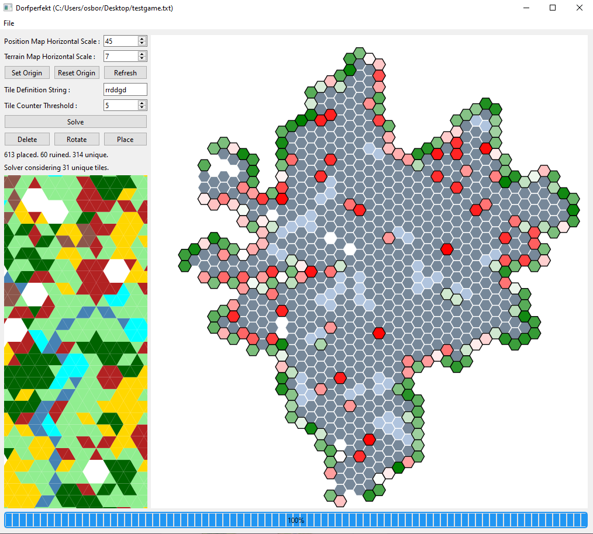

# Dorfperfekt

Tile placement suggestions for the game Dorfromantik.

## Installation

From the command line, install with `pip install dorfperfekt`. The application can then be run from the command line with `dorfperfekt`.

## Usage

Dorfperfekt displays an overall map of the board at the top. Blue tiles are perfect (or potentially perfect) placements, whereas yellow tiles are ruined placements. A text string representing the next tile to be placed is entered in the text field. The solve button will then compute a ranking of all possible moves using some heuristics and draw a green/red heatmap.

Positions on the map can be clicked on. By clicking on a proposed position for your next placement, a view of the local area showing the terrains is generated at the bottom. The tile to be placed is given a proposed rotation, but the user may use the rotation buttons to select an alternate rotation.




### Tile Definitions

A tile is defined by a six character text string, where each character represents the edge's terrain in clockwise order. If all edges of the tile are the same, a single character may be used instead. Tile characters are deliberatly selected to all be accessible from the left hand.

- Grass, "g"
- Forest, "f"
- Ranch, "r" (ie. wheat/lavender fields)
- Dwelling, "d" (ie. houses)
- Water, "w" (ie. rivers)
- Station, "s"
- Train, "t"
- Coast, "c" (ie. lakes)

## Work to Go

1. Add a save/load feature.
2. Fix the terrain map to show non-contiguous local tiles.
3. Better optimize the ratings computation for speed.
4. Add support for a central terrain, quests, and flags.
5. Experiment with different heuristics.

## Development

Setting up the software development environment is easy.

```bash
poetry install
poetry run pre-commit install
```
